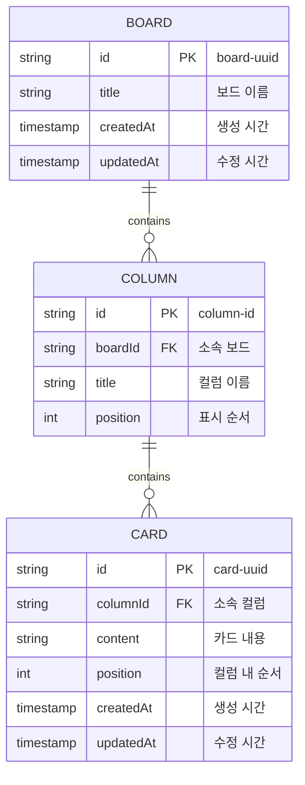
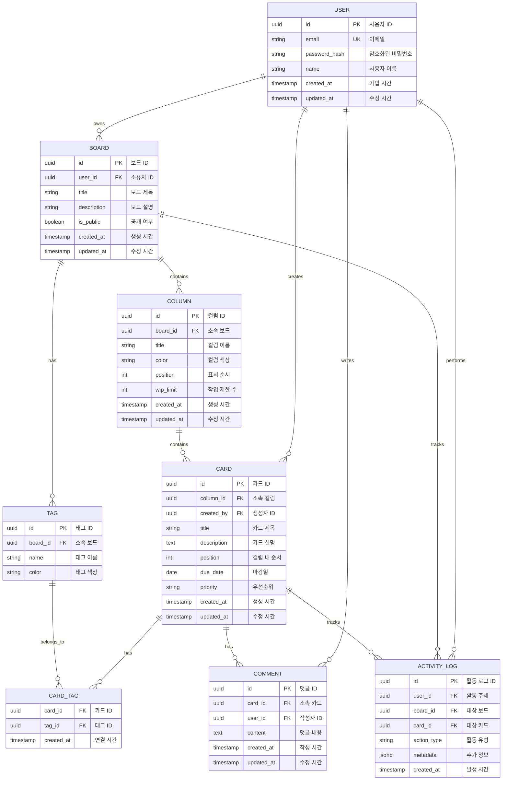

# Database Design (데이터베이스 설계)
# 칸반보드 애플리케이션

## 개요

현재 MVP 버전은 **백엔드 없이 순수 프론트엔드**로 구현되므로 실제 데이터베이스는 사용하지 않습니다. 그러나 향후 확장을 위해 다음 두 가지 시나리오의 데이터 모델을 정의합니다:

1. **LocalStorage 기반** (Phase 2): 브라우저 로컬 스토리지 사용
2. **백엔드 데이터베이스** (Phase 3+): PostgreSQL/MySQL 사용

---

## 1. 현재 구현 (MVP) - 메모리 기반

### 1.1 데이터 구조 (JavaScript 객체)

```javascript
// 카드 객체
const card = {
  id: 'card-1716123456789',    // 타임스탬프 기반 고유 ID
  content: 'Review PR #123',   // 카드 내용 (최대 500자)
  columnId: 'todo',            // 소속 컬럼 ID
  createdAt: 1716123456789     // 생성 시간 (Unix timestamp)
};

// 컬럼 정의 (상수)
const COLUMNS = {
  TODO: { id: 'todo', title: 'To-Do' },
  IN_PROGRESS: { id: 'in-progress', title: 'In-Progress' },
  DONE: { id: 'done', title: 'Done' }
};

// 초기 샘플 데이터
const initialData = [
  { id: 'card-1', content: 'Review project requirements', columnId: 'todo' },
  { id: 'card-2', content: 'Design database schema', columnId: 'todo' },
  { id: 'card-3', content: 'Implement drag and drop', columnId: 'in-progress' },
  { id: 'card-4', content: 'Setup project structure', columnId: 'done' }
];
```

### 1.2 특징
- 페이지 새로고침 시 데이터 초기화
- DOM이 진실의 원천 (Source of Truth)
- 별도의 상태 관리 라이브러리 없음

---

## 2. LocalStorage 기반 (Phase 2)

### 2.1 개념적 ERD



### 2.2 LocalStorage 스키마

#### 키 구조
```javascript
localStorage['kanban_board']     // 보드 설정
localStorage['kanban_columns']   // 컬럼 배열
localStorage['kanban_cards']     // 카드 배열
localStorage['kanban_settings']  // 사용자 설정
```

#### 데이터 예시
```json
// localStorage['kanban_board']
{
  "id": "board-default",
  "title": "My Kanban Board",
  "createdAt": 1716123456789,
  "updatedAt": 1716123456789
}

// localStorage['kanban_columns']
[
  { "id": "todo", "boardId": "board-default", "title": "To-Do", "position": 0 },
  { "id": "in-progress", "boardId": "board-default", "title": "In-Progress", "position": 1 },
  { "id": "done", "boardId": "board-default", "title": "Done", "position": 2 }
]

// localStorage['kanban_cards']
[
  {
    "id": "card-1716123456789",
    "columnId": "todo",
    "content": "Write documentation",
    "position": 0,
    "createdAt": 1716123456789,
    "updatedAt": 1716123456789
  },
  {
    "id": "card-1716123456790",
    "columnId": "in-progress",
    "content": "Implement feature X",
    "position": 0,
    "createdAt": 1716123456790,
    "updatedAt": 1716123456790
  }
]

// localStorage['kanban_settings']
{
  "theme": "light",
  "autoSave": true,
  "maxCardsPerColumn": 100
}
```

### 2.3 API 인터페이스

```javascript
// 데이터 로드
function loadFromLocalStorage() {
  const cards = JSON.parse(localStorage.getItem('kanban_cards') || '[]');
  return cards;
}

// 데이터 저장
function saveToLocalStorage(cards) {
  localStorage.setItem('kanban_cards', JSON.stringify(cards));
  localStorage.setItem('kanban_updated_at', Date.now().toString());
}

// 카드 추가
function addCard(content, columnId) {
  const cards = loadFromLocalStorage();
  const newCard = {
    id: `card-${Date.now()}`,
    columnId,
    content,
    position: cards.filter(c => c.columnId === columnId).length,
    createdAt: Date.now(),
    updatedAt: Date.now()
  };
  cards.push(newCard);
  saveToLocalStorage(cards);
  return newCard;
}

// 카드 이동
function moveCard(cardId, newColumnId, newPosition) {
  const cards = loadFromLocalStorage();
  const card = cards.find(c => c.id === cardId);
  if (card) {
    card.columnId = newColumnId;
    card.position = newPosition;
    card.updatedAt = Date.now();
    saveToLocalStorage(cards);
  }
}

// 카드 삭제
function deleteCard(cardId) {
  let cards = loadFromLocalStorage();
  cards = cards.filter(c => c.id !== cardId);
  saveToLocalStorage(cards);
}
```

### 2.4 제약사항
- **용량 제한**: 브라우저당 5-10MB (브라우저별 상이)
- **동기화 없음**: 다른 기기나 브라우저와 공유 불가
- **보안**: 민감 정보 저장 부적합

---

## 3. 백엔드 데이터베이스 (Phase 3+)

### 3.1 관계형 데이터베이스 ERD



### 3.2 테이블 정의 (PostgreSQL)

#### 3.2.1 users 테이블
```sql
CREATE TABLE users (
    id UUID PRIMARY KEY DEFAULT gen_random_uuid(),
    email VARCHAR(255) UNIQUE NOT NULL,
    password_hash VARCHAR(255) NOT NULL,
    name VARCHAR(100) NOT NULL,
    avatar_url VARCHAR(500),
    created_at TIMESTAMP WITH TIME ZONE DEFAULT CURRENT_TIMESTAMP,
    updated_at TIMESTAMP WITH TIME ZONE DEFAULT CURRENT_TIMESTAMP
);

CREATE INDEX idx_users_email ON users(email);
```

#### 3.2.2 boards 테이블
```sql
CREATE TABLE boards (
    id UUID PRIMARY KEY DEFAULT gen_random_uuid(),
    user_id UUID NOT NULL REFERENCES users(id) ON DELETE CASCADE,
    title VARCHAR(200) NOT NULL,
    description TEXT,
    is_public BOOLEAN DEFAULT FALSE,
    created_at TIMESTAMP WITH TIME ZONE DEFAULT CURRENT_TIMESTAMP,
    updated_at TIMESTAMP WITH TIME ZONE DEFAULT CURRENT_TIMESTAMP
);

CREATE INDEX idx_boards_user_id ON boards(user_id);
CREATE INDEX idx_boards_created_at ON boards(created_at DESC);
```

#### 3.2.3 columns 테이블
```sql
CREATE TABLE columns (
    id UUID PRIMARY KEY DEFAULT gen_random_uuid(),
    board_id UUID NOT NULL REFERENCES boards(id) ON DELETE CASCADE,
    title VARCHAR(100) NOT NULL,
    color VARCHAR(7) DEFAULT '#ebecf0',
    position INTEGER NOT NULL,
    wip_limit INTEGER DEFAULT NULL,
    created_at TIMESTAMP WITH TIME ZONE DEFAULT CURRENT_TIMESTAMP,
    updated_at TIMESTAMP WITH TIME ZONE DEFAULT CURRENT_TIMESTAMP,
    UNIQUE(board_id, position)
);

CREATE INDEX idx_columns_board_id ON columns(board_id);
CREATE INDEX idx_columns_position ON columns(board_id, position);
```

#### 3.2.4 cards 테이블
```sql
CREATE TABLE cards (
    id UUID PRIMARY KEY DEFAULT gen_random_uuid(),
    column_id UUID NOT NULL REFERENCES columns(id) ON DELETE CASCADE,
    created_by UUID NOT NULL REFERENCES users(id) ON DELETE SET NULL,
    title VARCHAR(500) NOT NULL,
    description TEXT,
    position INTEGER NOT NULL,
    due_date DATE,
    priority VARCHAR(20) CHECK (priority IN ('low', 'medium', 'high', 'urgent')),
    created_at TIMESTAMP WITH TIME ZONE DEFAULT CURRENT_TIMESTAMP,
    updated_at TIMESTAMP WITH TIME ZONE DEFAULT CURRENT_TIMESTAMP,
    UNIQUE(column_id, position)
);

CREATE INDEX idx_cards_column_id ON cards(column_id);
CREATE INDEX idx_cards_position ON cards(column_id, position);
CREATE INDEX idx_cards_created_by ON cards(created_by);
CREATE INDEX idx_cards_due_date ON cards(due_date) WHERE due_date IS NOT NULL;
```

#### 3.2.5 tags 테이블
```sql
CREATE TABLE tags (
    id UUID PRIMARY KEY DEFAULT gen_random_uuid(),
    board_id UUID NOT NULL REFERENCES boards(id) ON DELETE CASCADE,
    name VARCHAR(50) NOT NULL,
    color VARCHAR(7) DEFAULT '#0052cc',
    UNIQUE(board_id, name)
);

CREATE INDEX idx_tags_board_id ON tags(board_id);
```

#### 3.2.6 card_tags 테이블
```sql
CREATE TABLE card_tags (
    card_id UUID NOT NULL REFERENCES cards(id) ON DELETE CASCADE,
    tag_id UUID NOT NULL REFERENCES tags(id) ON DELETE CASCADE,
    created_at TIMESTAMP WITH TIME ZONE DEFAULT CURRENT_TIMESTAMP,
    PRIMARY KEY (card_id, tag_id)
);

CREATE INDEX idx_card_tags_card_id ON card_tags(card_id);
CREATE INDEX idx_card_tags_tag_id ON card_tags(tag_id);
```

#### 3.2.7 comments 테이블
```sql
CREATE TABLE comments (
    id UUID PRIMARY KEY DEFAULT gen_random_uuid(),
    card_id UUID NOT NULL REFERENCES cards(id) ON DELETE CASCADE,
    user_id UUID NOT NULL REFERENCES users(id) ON DELETE CASCADE,
    content TEXT NOT NULL,
    created_at TIMESTAMP WITH TIME ZONE DEFAULT CURRENT_TIMESTAMP,
    updated_at TIMESTAMP WITH TIME ZONE DEFAULT CURRENT_TIMESTAMP
);

CREATE INDEX idx_comments_card_id ON comments(card_id, created_at DESC);
CREATE INDEX idx_comments_user_id ON comments(user_id);
```

#### 3.2.8 activity_logs 테이블
```sql
CREATE TABLE activity_logs (
    id UUID PRIMARY KEY DEFAULT gen_random_uuid(),
    user_id UUID NOT NULL REFERENCES users(id) ON DELETE CASCADE,
    board_id UUID REFERENCES boards(id) ON DELETE CASCADE,
    card_id UUID REFERENCES cards(id) ON DELETE CASCADE,
    action_type VARCHAR(50) NOT NULL,
    metadata JSONB DEFAULT '{}',
    created_at TIMESTAMP WITH TIME ZONE DEFAULT CURRENT_TIMESTAMP
);

CREATE INDEX idx_activity_logs_board_id ON activity_logs(board_id, created_at DESC);
CREATE INDEX idx_activity_logs_card_id ON activity_logs(card_id, created_at DESC);
CREATE INDEX idx_activity_logs_user_id ON activity_logs(user_id, created_at DESC);
CREATE INDEX idx_activity_logs_action_type ON activity_logs(action_type);
```

### 3.3 쿼리 예시

#### 보드의 모든 카드 조회 (컬럼별)
```sql
SELECT 
    col.id AS column_id,
    col.title AS column_title,
    col.position AS column_position,
    json_agg(
        json_build_object(
            'id', c.id,
            'title', c.title,
            'description', c.description,
            'position', c.position,
            'created_by', u.name,
            'created_at', c.created_at
        ) ORDER BY c.position
    ) AS cards
FROM columns col
LEFT JOIN cards c ON c.column_id = col.id
LEFT JOIN users u ON u.id = c.created_by
WHERE col.board_id = $1
GROUP BY col.id, col.title, col.position
ORDER BY col.position;
```

#### 카드를 다른 컬럼으로 이동
```sql
-- 트랜잭션 시작
BEGIN;

-- 1. 카드의 컬럼 변경
UPDATE cards
SET column_id = $2, position = $3, updated_at = CURRENT_TIMESTAMP
WHERE id = $1;

-- 2. 활동 로그 기록
INSERT INTO activity_logs (user_id, board_id, card_id, action_type, metadata)
VALUES (
    $4,
    (SELECT board_id FROM columns WHERE id = $2),
    $1,
    'card_moved',
    jsonb_build_object('from_column', $5, 'to_column', $2)
);

COMMIT;
```

#### 특정 사용자의 모든 보드 조회
```sql
SELECT 
    b.id,
    b.title,
    b.description,
    b.is_public,
    b.created_at,
    COUNT(DISTINCT col.id) AS column_count,
    COUNT(DISTINCT c.id) AS card_count
FROM boards b
LEFT JOIN columns col ON col.board_id = b.id
LEFT JOIN cards c ON c.column_id = col.id
WHERE b.user_id = $1
GROUP BY b.id, b.title, b.description, b.is_public, b.created_at
ORDER BY b.created_at DESC;
```

### 3.4 인덱스 전략

- **Primary Keys**: 모든 테이블에 UUID 기반 PK
- **Foreign Keys**: 조인 성능 향상을 위한 FK 인덱스
- **Composite Indexes**: (board_id, position), (column_id, position)
- **Partial Indexes**: due_date가 NULL이 아닌 카드만

### 3.5 트리거 (updated_at 자동 갱신)

```sql
CREATE OR REPLACE FUNCTION update_updated_at_column()
RETURNS TRIGGER AS $$
BEGIN
    NEW.updated_at = CURRENT_TIMESTAMP;
    RETURN NEW;
END;
$$ LANGUAGE plpgsql;

CREATE TRIGGER update_boards_updated_at
    BEFORE UPDATE ON boards
    FOR EACH ROW
    EXECUTE FUNCTION update_updated_at_column();

CREATE TRIGGER update_cards_updated_at
    BEFORE UPDATE ON cards
    FOR EACH ROW
    EXECUTE FUNCTION update_updated_at_column();

-- 다른 테이블에도 동일하게 적용
```

---

## 4. 데이터 마이그레이션

### 4.1 LocalStorage → 백엔드
```javascript
async function migrateToBackend() {
  const localCards = JSON.parse(localStorage.getItem('kanban_cards') || '[]');
  
  for (const card of localCards) {
    await fetch('/api/cards', {
      method: 'POST',
      headers: { 'Content-Type': 'application/json' },
      body: JSON.stringify({
        title: card.content,
        columnId: card.columnId,
        position: card.position
      })
    });
  }
  
  console.log('Migration complete');
}
```

### 4.2 백엔드 → LocalStorage (오프라인 캐싱)
```javascript
async function cacheToLocal() {
  const response = await fetch('/api/boards/my-board/cards');
  const cards = await response.json();
  localStorage.setItem('kanban_cards_cache', JSON.stringify(cards));
  localStorage.setItem('kanban_cache_time', Date.now().toString());
}
```

---

## 5. 확장성 고려사항

### 5.1 샤딩 전략
- **User ID 기반 샤딩**: 대규모 멀티테넌트 시나리오
- **Board ID 기반 샤딩**: 보드별 독립 관리

### 5.2 캐싱
- **Redis**: 활성 보드 데이터 캐싱
- **CDN**: 정적 에셋 (이미지, 아바타)

### 5.3 실시간 동기화
- **WebSocket**: 보드 변경사항 실시간 푸시
- **Conflict Resolution**: Operational Transform 또는 CRDT

---

## 요약

| Phase | 저장소 | 특징 | 제약사항 |
|-------|--------|------|---------|
| **MVP** | 메모리 (DOM) | 즉시 사용 가능, 단순함 | 새로고침 시 초기화 |
| **Phase 2** | LocalStorage | 영속성, 오프라인 작동 | 5-10MB 제한, 단일 브라우저 |
| **Phase 3+** | PostgreSQL | 다중 사용자, 무제한 용량 | 백엔드 필요, 네트워크 의존 |

현재 MVP는 데이터베이스 없이 작동하지만, 위의 설계는 향후 확장 시 참고할 수 있습니다.
