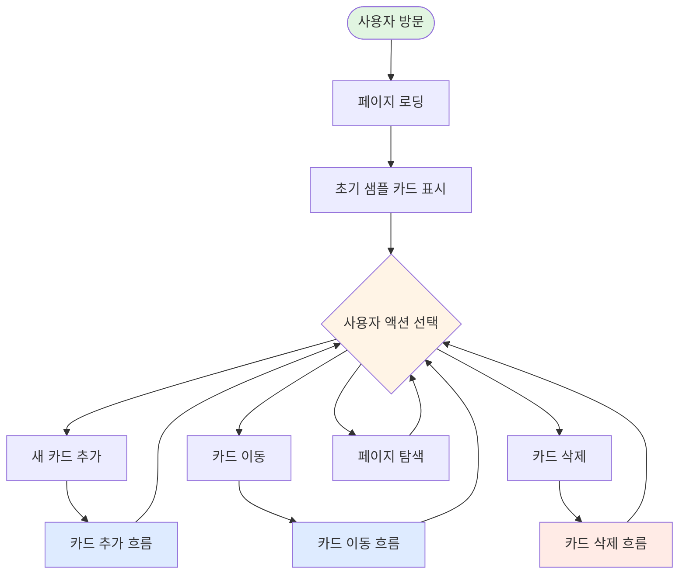
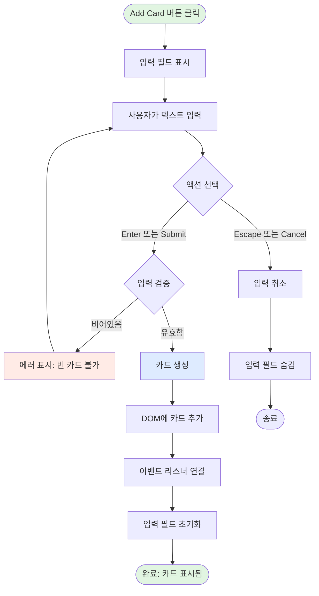
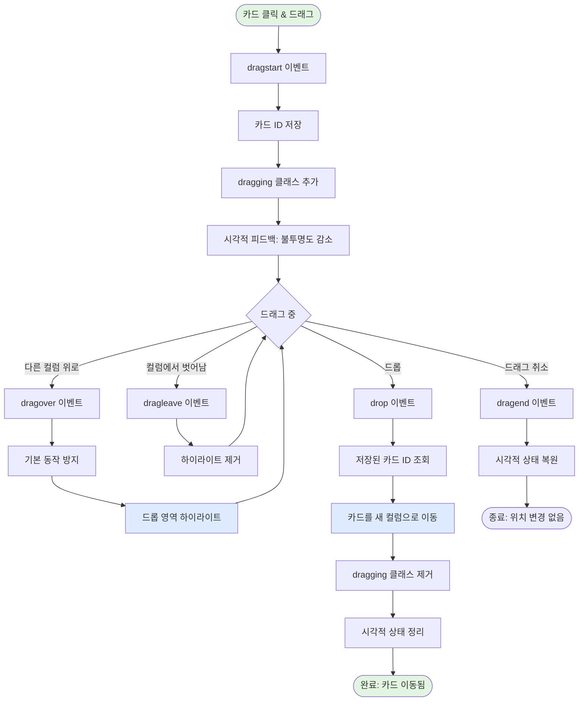
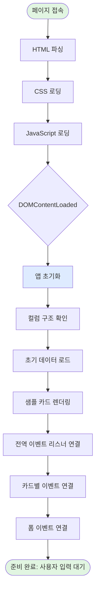
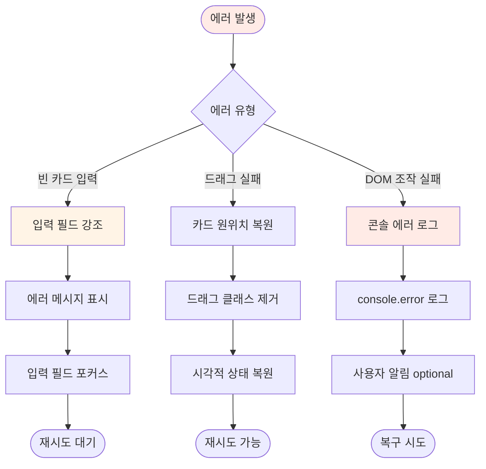
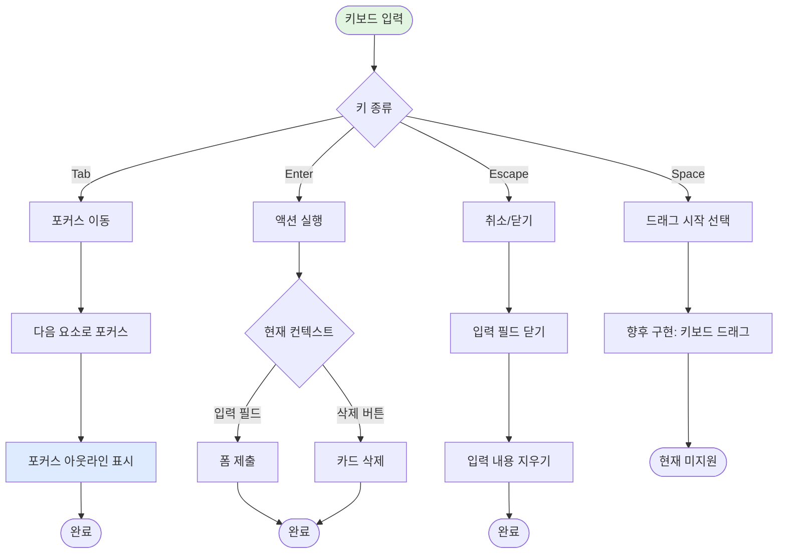
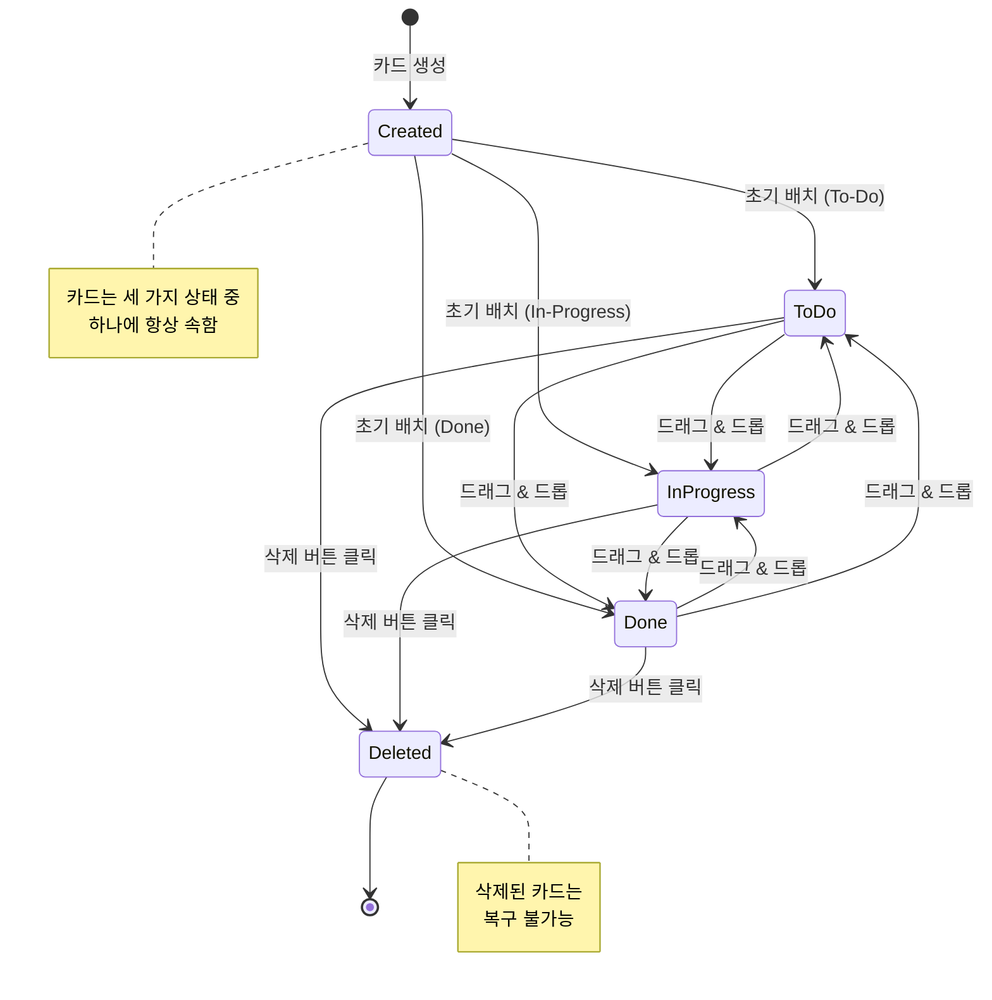
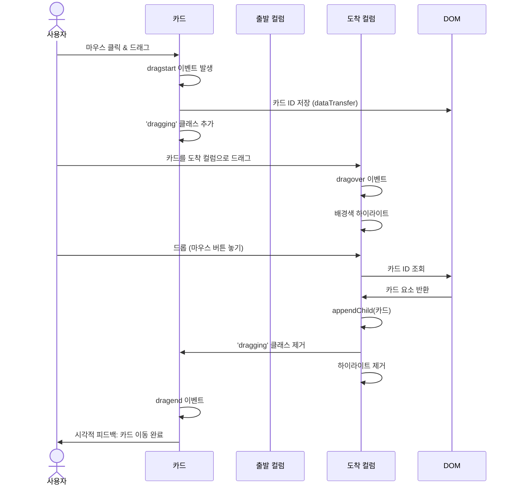

# User Flow (사용자 흐름도)
# 칸반보드 애플리케이션

## 1. 전체 사용자 흐름



## 2. 카드 추가 흐름 (Add Card Flow)



### 상세 단계

#### 2.1 입력 시작
1. 사용자가 컬럼 하단의 "Add Card" 버튼 클릭
2. 텍스트 입력 필드와 제출 버튼 표시
3. 입력 필드에 자동 포커스

#### 2.2 텍스트 입력
- 사용자가 작업 내용 입력
- 실시간 글자 수 표시 (선택 사항)
- Enter 키로 빠른 제출 가능

#### 2.3 검증 및 생성
- **빈 입력**: 에러 메시지 표시, 제출 차단
- **유효 입력**: 카드 생성, DOM에 추가
- XSS 방지를 위해 HTML 이스케이프

#### 2.4 완료
- 카드가 해당 컬럼에 표시됨
- 입력 필드 초기화
- 드래그 앤 드롭 이벤트 자동 연결

## 3. 카드 이동 흐름 (Drag and Drop Flow)



### 상세 단계

#### 3.1 드래그 시작 (dragstart)
1. 사용자가 카드를 마우스로 클릭 & 드래그
2. `dataTransfer`에 카드 ID 저장
3. 카드에 `dragging` 클래스 추가 → 불투명도 50%
4. 커서 모양 변경: `grabbing`

#### 3.2 드래그 중 (dragover, dragenter, dragleave)
- **dragover**: 드롭 가능하도록 `e.preventDefault()` 호출
- **dragenter**: 컬럼에 진입 시 배경색 변경 (하이라이트)
- **dragleave**: 컬럼을 벗어날 시 하이라이트 제거

#### 3.3 드롭 (drop)
1. `dataTransfer`에서 카드 ID 추출
2. 해당 카드를 DOM에서 찾기
3. 목표 컬럼의 `.cards-container`에 `appendChild()`
4. 모든 드래그 관련 클래스 제거
5. 하이라이트 제거

#### 3.4 드래그 종료 (dragend)
- 드롭 성공 여부와 무관하게 호출
- 시각적 상태 정리 (클래스 제거)

## 4. 카드 삭제 흐름 (Delete Card Flow)

```mermaid
flowchart TD
    Start([삭제 버튼 × 클릭]) --> Identify[이벤트 타겟 식별]
    Identify --> FindCard[closest('.card')로 카드 찾기]
    FindCard --> Confirm{확인 필요?}
    
    Confirm -->|아니오 즉시 삭제| Remove[card.remove 호출]
    Confirm -->|예 확인 필요| ShowDialog[확인 대화상자 표시]
    
    ShowDialog --> UserChoice{사용자 선택}
    UserChoice -->|취소| Cancel([취소: 변경 없음])
    UserChoice -->|확인| Remove
    
    Remove --> RemoveFromDOM[DOM에서 카드 제거]
    RemoveFromDOM --> CleanUp[이벤트 리스너 정리]
    CleanUp --> Success([완료: 카드 삭제됨])
    
    style Start fill:#ffebe6
    style Success fill:#e1f5e1
    style Remove fill:#ffebe6
```

### 상세 단계

#### 4.1 삭제 시작
1. 사용자가 카드의 삭제 버튼(×) 클릭
2. 이벤트 위임으로 클릭 감지
3. `closest('.card')`로 부모 카드 요소 찾기

#### 4.2 확인 (선택 사항)
- MVP에서는 즉시 삭제 (확인 없음)
- 향후 `confirm()` 또는 커스텀 모달 추가 가능

#### 4.3 삭제 실행
1. `card.remove()` 호출하여 DOM에서 제거
2. 이벤트 리스너 자동 정리 (가비지 컬렉션)
3. 복구 불가능 (Undo 기능 없음)

## 5. 페이지 로딩 흐름 (Initial Load Flow)



### 상세 단계

#### 5.1 리소스 로딩
1. HTML 문서 파싱
2. `<link>` 태그의 CSS 로드
3. `<script>` 태그의 JS 로드 (defer 사용 권장)

#### 5.2 DOM 준비
- `DOMContentLoaded` 이벤트 대기
- DOM 트리 완성 확인

#### 5.3 앱 초기화
```javascript
document.addEventListener('DOMContentLoaded', () => {
  initializeApp();
});

function initializeApp() {
  renderInitialCards();
  attachEventListeners();
  setupDragAndDrop();
}
```

#### 5.4 초기 카드 렌더링
1. `initialData` 배열 순회
2. 각 카드에 대해 `createCard()` 호출
3. 해당 컬럼의 `.cards-container`에 추가

#### 5.5 이벤트 연결
- 전역: 보드 레벨 이벤트 위임
- 카드: dragstart, dragend
- 컬럼: dragover, drop
- 폼: submit, input 이벤트

## 6. 에러 처리 흐름 (Error Handling)



## 7. 키보드 네비게이션 흐름 (Keyboard Navigation)



## 8. 주요 사용자 시나리오

### 시나리오 1: 새 작업 추가
1. 사용자가 "To-Do" 컬럼의 "Add Card" 클릭
2. 입력 필드에 "API 문서 작성" 입력
3. Enter 키 또는 추가 버튼 클릭
4. 새 카드가 To-Do 컬럼에 표시됨

### 시나리오 2: 작업 진행 상태 변경
1. To-Do의 "API 문서 작성" 카드를 드래그
2. In-Progress 컬럼으로 이동
3. 드롭 → 카드가 In-Progress로 이동
4. 작업 완료 후 Done 컬럼으로 다시 드래그

### 시나리오 3: 불필요한 작업 삭제
1. 잘못 추가된 카드 발견
2. 카드의 × 버튼 클릭
3. 카드 즉시 제거

### 시나리오 4: 첫 방문자 탐색
1. 페이지 로딩 → 샘플 카드 4개 표시
2. 샘플 카드를 드래그해보며 기능 파악
3. 샘플 카드 삭제 또는 유지
4. 자신의 작업 추가 시작

## 9. 상태 다이어그램 (카드 생명주기)



## 10. 시퀀스 다이어그램 (카드 이동)



---

## 요약

이 문서는 칸반보드 애플리케이션의 모든 사용자 흐름을 Mermaid 차트로 시각화했습니다.

**주요 흐름:**
1. **카드 추가**: 입력 → 검증 → 생성 → DOM 추가
2. **카드 이동**: 드래그 시작 → 드래그 중 피드백 → 드롭 → DOM 이동
3. **카드 삭제**: 클릭 → 확인(선택) → DOM 제거
4. **초기 로딩**: HTML/CSS/JS 로드 → DOM 준비 → 샘플 카드 렌더링

각 흐름은 명확한 시작과 종료 지점을 가지며, 에러 처리 및 대안 경로도 포함되어 있습니다.
